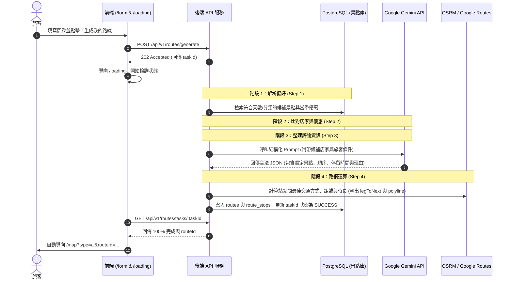

# 島轉 KinmenChamp AI 與外部服務管線整合規範 (AI & Services Integration)

本手冊針對專案 README 規劃之四項核心外部資料整合進行規格化定義：
1. **Google Place API**：店家資訊與精準 WGS-84 座標匯入
2. **lobster.io + Gemini**：店家真實評論抓取與 AI 總結（3 點精華摘要）
3. **Jina Reader + Gemini**：在地旅遊情報、活動與新聞擷取（動態牆卡片）
4. **Gemini 結構化輸出 (Structured Outputs)**：AI 客製化路線生成與 OSRM 路徑運算

---

## 1. Gemini AI 客製化路線生成管線 (核心)

### 執行時序圖



### Gemini 結構化輸出 Prompt 設計 (Structured Output)

使用 `gemini-1.5-flash` 或 `gemini-2.0-flash` 配合 `response_schema`：

#### 系統提示詞 (System Prompt)
```text
你是一位深耕金門在地的資深旅遊嚮導專家，熟悉金門各鄉鎮（金城、金寧、金沙、金湖、烈嶼）的地理歷史、交通動線、戰地文化與在地隱藏版美食。
你的任務是根據使用者的條件（旅行時長、同行對象、偏好體驗與特殊備註），從提供的「金門在地精選景點候選庫」中，規劃出一條動線順暢、不走回頭路、節奏舒適且富含在地文化的一日遊路線。

規則限制：
1. 嚴格遵守停留時間（半天約 2~3 站，一天約 3~5 站）。
2. 動線必須依地理鄰近性排序，避免東半島與西半島來回折返。
3. 若有備註「不想走太多路」或「帶著長輩」，需減少步行程並增加定點休憩。
4. 輸出必須完全符合指定的 JSON Schema 格式，不得含有任何 Markdown 外框或額外字元。
```

#### 回傳 JSON Schema 定義
```json
{
  "type": "OBJECT",
  "properties": {
    "routeName": { "type": "STRING", "description": "吸引人的路線主題名稱" },
    "overviewTip": { "type": "STRING", "description": "行程總結與貼心提醒" },
    "recommendedStartTime": { "type": "STRING", "description": "建議出發時間，如 09:30" },
    "stops": {
      "type": "ARRAY",
      "items": {
        "type": "OBJECT",
        "properties": {
          "placeId": { "type": "STRING", "description": "選自候選庫之景點 ID" },
          "order": { "type": "INTEGER", "description": "遊程順序 1, 2, 3..." },
          "customDesc": { "type": "STRING", "description": "針對該旅客的推薦玩法或停留重點" },
          "stayMin": { "type": "INTEGER", "description": "建議停留分鐘數" }
        },
        "required": ["placeId", "order", "customDesc", "stayMin"]
      }
    }
  },
  "required": ["routeName", "overviewTip", "recommendedStartTime", "stops"]
}
```

---

## 2. lobster.io + Gemini 評論摘要管線

對應地圖卡片（DetailCard）中呈現的「AI 評論總結」（`aiSummary: string[]`）。

### 流程步驟
1. **抓取**：透過 lobster.io API 定期（如每週一次）取得目標店家之最新 30~50 筆 Google Maps 旅客原始評論與評分。
2. **清洗**：過濾過短、廣告、或非實質內容的評語。
3. **摘要 Prompt**：交由 Gemini 統整為 **3 條高度概括的重點**（優點特色、招牌推薦、注意事項）。

### Gemini 總結 Prompt
```text
以下是金門店家「{placeName}」的真實顧客評論：
---
{reviews_text}
---

請以金門旅遊嚮導的客觀角度，分析並濃縮成恰好「3 條條列式重點」（每條 15~25 字內）：
第 1 條：環境氣氛或招牌特色
第 2 條：必點料理/必看亮點或服務評價
第 3 條：實用注意事項（例如：停車不易、建議先訂位、開店早賣完為止等）

回傳格式必須為 JSON 陣列：
["重點一", "重點二", "重點三"]
```

---

## 3. Jina Reader + Gemini 在地動態牆情報管線

對應地圖主頁面右側「在地動態牆」（`feed: FeedItem[]`）。

### 抓取來源
- 金門縣觀光處（最新活動快訊、交通管制公告）
- 金門日報（文化盛事、在地生活特稿）
- 在地文化工作者刊物 / 社群發布

### 整合流程
1. 使用 `https://r.jina.ai/{TARGET_URL}` 轉成 Markdown 文本。
2. 將長篇報導餵給 Gemini 進行資訊萃取。

### Gemini 提示詞
```text
閱讀以下金門在地新聞/活動文章：
---
{jina_markdown_content}
---

請為遊客端「在地動態牆」產出精簡卡片資訊，輸出格式為 JSON：
{
  "title": "簡短吸睛標題 (16 字以內)",
  "summary": "旅客實用摘要，重點指出活動時間、地點或核心看點 (50 字以內)",
  "source": "發布來源單位名稱",
  "tags": ["標籤1", "標籤2"]
}
```

---

## 4. Google Place API 店家資料匯入規格

用於維護後台店家經緯度、標準名稱與基礎資訊。

* **使用的 Google API**：Places API (New) - `Place Details`
* **請求欄位**：
  `id,displayName,formattedAddress,location,rating,userRatingCount,regularOpeningHours,nationalPhoneNumber`
* **資料庫對應欄位**：
  - `displayName.text` $\rightarrow$ `places.name`
  - `location.latitude` $\rightarrow$ `places.lat`
  - `location.longitude` $\rightarrow$ `places.lng`
  - `rating` $\rightarrow$ `places.rating`
  - `userRatingCount` $\rightarrow$ `places.review_count`
  - `formattedAddress` $\rightarrow$ `places.address`
  - `nationalPhoneNumber` $\rightarrow$ `places.phone`

---

## 5. 站點間路網與交通時間計算 (OSRM / Routing Engine)

在生成路線後，需填補 `legToNext`（例如：「步行 8 分鐘到下一站」）與地圖折線 `polyline`。

* **運算方式**：
  呼叫 OSRM（Open Source Routing Machine）或 Google Routes API：
  - 若兩點距離 $< 1.2\text{ km}$：預設為步行模式（Walking Profile），產生「步行 X 分鐘到下一站」。
  - 若兩點距離 $\ge 1.2\text{ km}$：切換為機車/汽車模式（Driving Profile），產生「開車/騎車 X 分鐘到下一站」。
  - 路線折線坐標以 `[ [lat, lng], [lat, lng], ... ]` 寫入 `routes.polyline`，直接餵給 Leaflet 的 `<Polyline positions={routePositions} />`。
