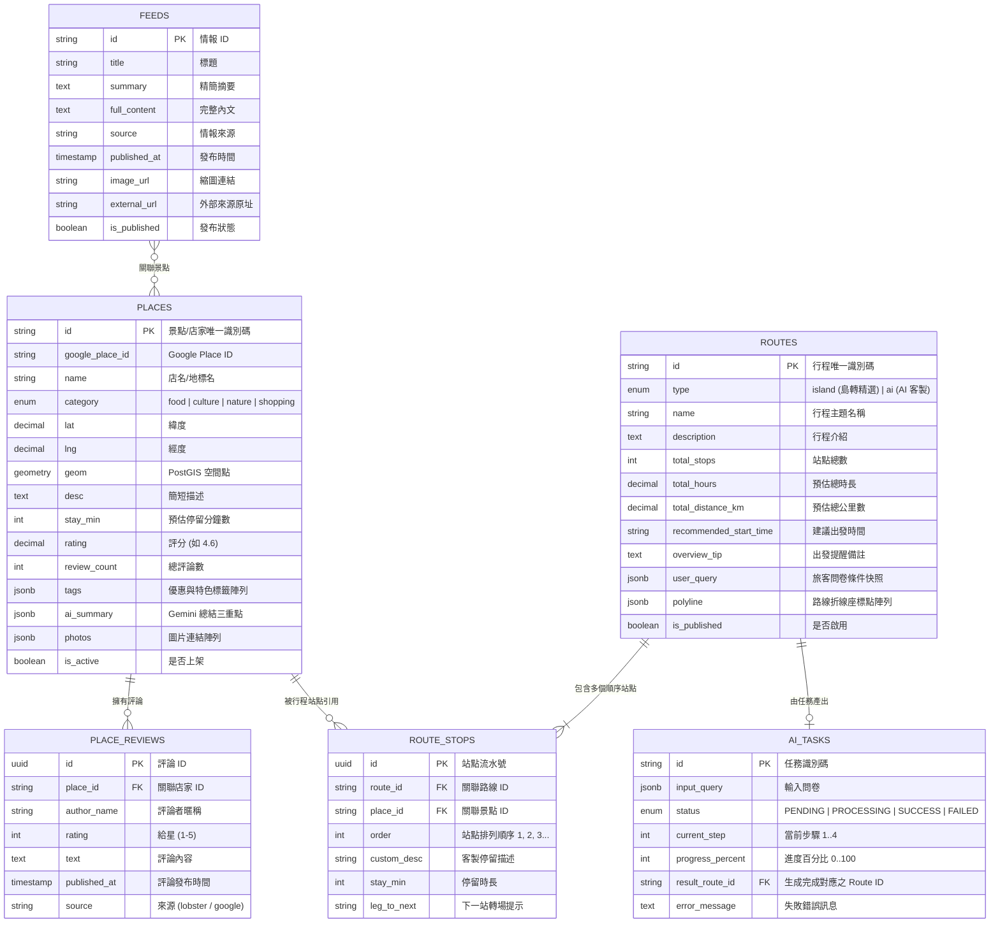

# 島轉 KinmenChamp 資料庫模型設計 (Database Schema)

本專案建議採用 **PostgreSQL 16** 搭配 **PostGIS** 擴充套件，兼顧金門地區地理座標空間索引（Geospatial Indexing）、高效鄰近搜尋（`ST_DWithin`、`ST_DistanceSphere`）與 JSONB 彈性欄位儲存。

---

## 實體關聯圖 (ER Diagram)



---

## 資料表詳細定義 (DDL - PostgreSQL)

### 1. 景點與店家表 (`places`)
對應前端 `Stop` 與地圖上的探索點 `extraPois`。

```sql
CREATE TYPE place_category AS ENUM ('food', 'culture', 'nature', 'shopping');

CREATE TABLE places (
    id VARCHAR(64) PRIMARY KEY,                       -- 例如 's1', 's2', 'p1' 或 UUID
    google_place_id VARCHAR(128) UNIQUE,             -- Google Maps Place ID
    name VARCHAR(128) NOT NULL,                      -- 例如 '依山村驛民宿'
    category place_category NOT NULL,                -- 分類：food | culture | nature | shopping
    lat DECIMAL(10, 7) NOT NULL,                     -- 緯度 (WGS84)
    lng DECIMAL(10, 7) NOT NULL,                     -- 經度 (WGS84)
    geom GEOMETRY(Point, 4326),                      -- PostGIS 空間幾何欄位
    address VARCHAR(255),                            -- 實際地址
    phone VARCHAR(32),                               -- 聯絡電話
    opening_hours JSONB,                             -- 營業時間結構化資訊
    description TEXT,                                -- 簡短說明，例如 '報到領好禮，行程起點'
    stay_min INT NOT NULL DEFAULT 30,                -- 建議停留分鐘數
    rating DECIMAL(2, 1) NOT NULL DEFAULT 5.0,       -- 評分 (如 4.7)
    review_count INT NOT NULL DEFAULT 0,             -- 評論總數
    tags JSONB NOT NULL DEFAULT '[]'::jsonb,         -- 標籤陣列，如 ["優惠 9 折", "南管表演"]
    ai_summary JSONB NOT NULL DEFAULT '[]'::jsonb,   -- Gemini 生成的三條精要重點摘要
    photos JSONB NOT NULL DEFAULT '[]'::jsonb,       -- 圖片 URL 清單
    is_active BOOLEAN NOT NULL DEFAULT TRUE,         -- 軟下架開關
    created_at TIMESTAMPTZ NOT NULL DEFAULT NOW(),
    updated_at TIMESTAMPTZ NOT NULL DEFAULT NOW()
);

-- 建立 PostGIS 空間索引與分類複合索引
CREATE INDEX idx_places_geom ON places USING GIST (geom);
CREATE INDEX idx_places_category_active ON places (category, is_active);
CREATE INDEX idx_places_name_trgm ON places USING GIN (name gin_trgm_ops); -- 全文模糊搜尋
```

---

### 2. 店家評論表 (`place_reviews`)
由 lobster.io 爬取 Google 評論後寫入，做為 Gemini 整理總結與使用者點擊「看完整評論」之資料源。

```sql
CREATE TABLE place_reviews (
    id UUID PRIMARY KEY DEFAULT gen_random_uuid(),
    place_id VARCHAR(64) NOT NULL REFERENCES places(id) ON DELETE CASCADE,
    author_name VARCHAR(64) NOT NULL,
    author_avatar TEXT,
    rating SMALLINT NOT NULL CHECK (rating >= 1 AND rating <= 5),
    publish_time_display VARCHAR(32),                -- 如 '2 週前'
    published_at TIMESTAMPTZ,
    text TEXT NOT NULL,
    source VARCHAR(32) NOT NULL DEFAULT 'google',
    created_at TIMESTAMPTZ NOT NULL DEFAULT NOW()
);

CREATE INDEX idx_place_reviews_place_id ON place_reviews(place_id, published_at DESC);
```

---

### 3. 遊程主表 (`routes`)
儲存官方「島轉推薦」或由 AI 為使用者客製化的完整路線方案。

```sql
CREATE TYPE route_type AS ENUM ('island', 'ai');

CREATE TABLE routes (
    id VARCHAR(64) PRIMARY KEY,                      -- 如 'island-classic-01' 或 'route-ai-xxx'
    type route_type NOT NULL,                        -- 'island' (島轉推薦) 或 'ai' (AI 客製)
    name VARCHAR(128) NOT NULL,                      -- 如 '島轉在地精選・經典後浦慢遊'
    description TEXT,                                -- 遊程主述
    total_stops INT NOT NULL DEFAULT 0,              -- 總站點數
    total_hours DECIMAL(3, 1) NOT NULL DEFAULT 0.0,  -- 總時長 (小時)
    total_distance_km DECIMAL(4, 1) NOT NULL DEFAULT 0.0, -- 總公里數
    recommended_start_time VARCHAR(16) DEFAULT '09:30',   -- 建議出發時段
    overview_tip TEXT,                               -- 如 '全程約 2.6 公里，建議上午出發'
    user_query JSONB,                                -- AI 路線之使用者問卷條件快照 (天數、同行者、偏好)
    polyline JSONB NOT NULL DEFAULT '[]'::jsonb,     -- 地圖折線坐標陣列 [[lat, lng], ...]
    is_published BOOLEAN NOT NULL DEFAULT TRUE,
    created_at TIMESTAMPTZ NOT NULL DEFAULT NOW(),
    updated_at TIMESTAMPTZ NOT NULL DEFAULT NOW()
);

CREATE INDEX idx_routes_type_created ON routes(type, created_at DESC);
```

---

### 4. 遊程站點關聯表 (`route_stops`)
記錄路線中的景點序列、順序、停留時間與往下一站的銜接方式。

```sql
CREATE TABLE route_stops (
    id UUID PRIMARY KEY DEFAULT gen_random_uuid(),
    route_id VARCHAR(64) NOT NULL REFERENCES routes(id) ON DELETE CASCADE,
    place_id VARCHAR(64) NOT NULL REFERENCES places(id) ON DELETE RESTRICT,
    order_num INT NOT NULL,                          -- 站點順序：1, 2, 3...
    custom_desc TEXT,                                -- 本行程客製備註，如 '報到領好禮，行程起點'
    stay_min INT NOT NULL DEFAULT 30,                -- 本站預估停留時間
    leg_to_next VARCHAR(64),                         -- 下一站交通提示，如 '步行 8 分鐘到下一站'
    created_at TIMESTAMPTZ NOT NULL DEFAULT NOW(),
    UNIQUE(route_id, order_num)
);

CREATE INDEX idx_route_stops_route_id ON route_stops(route_id, order_num ASC);
```

---

### 5. 在地動態牆表 (`feeds`)
存放觀光處、在地生活誌、金門日報等活動與情報，對應地圖右側動態牆與「查看更多」。

```sql
CREATE TABLE feeds (
    id VARCHAR(64) PRIMARY KEY,                      -- 如 'f1', 'f2'
    title VARCHAR(255) NOT NULL,
    summary TEXT NOT NULL,                           -- 卡片上顯示的精煉摘要
    full_content TEXT,                               -- 完整報導或內文
    source VARCHAR(64) NOT NULL,                     -- 如 '金門縣觀光處', '在地生活誌'
    published_at TIMESTAMPTZ NOT NULL,
    image_url TEXT,                                  -- 縮圖 URL
    external_url TEXT,                               -- 原文連結
    tags JSONB DEFAULT '[]'::jsonb,
    is_published BOOLEAN NOT NULL DEFAULT TRUE,
    created_at TIMESTAMPTZ NOT NULL DEFAULT NOW(),
    updated_at TIMESTAMPTZ NOT NULL DEFAULT NOW()
);

CREATE INDEX idx_feeds_published_at ON feeds(published_at DESC);
```

---

### 6. AI 生成非同步任務佇列表 (`ai_tasks`)
支撐 `/loading` 頁面的分步狀態機與進度百分比。

```sql
CREATE TYPE task_status AS ENUM ('PENDING', 'PROCESSING', 'SUCCESS', 'FAILED');

CREATE TABLE ai_tasks (
    id VARCHAR(64) PRIMARY KEY,                      -- 如 'task-kinmen-ai-xxxx'
    user_query JSONB NOT NULL,                       -- 旅客提交的問卷 JSON
    status task_status NOT NULL DEFAULT 'PENDING',
    current_step SMALLINT NOT NULL DEFAULT 1,        -- 1: 讀取偏好, 2: 店家優惠比對, 3: 整理評論, 4: 產出路線
    progress_percent SMALLINT NOT NULL DEFAULT 0,    -- 0 ~ 100
    result_route_id VARCHAR(64) REFERENCES routes(id) ON DELETE SET NULL,
    error_message TEXT,
    created_at TIMESTAMPTZ NOT NULL DEFAULT NOW(),
    updated_at TIMESTAMPTZ NOT NULL DEFAULT NOW()
);

CREATE INDEX idx_ai_tasks_status ON ai_tasks(status, created_at);
```
